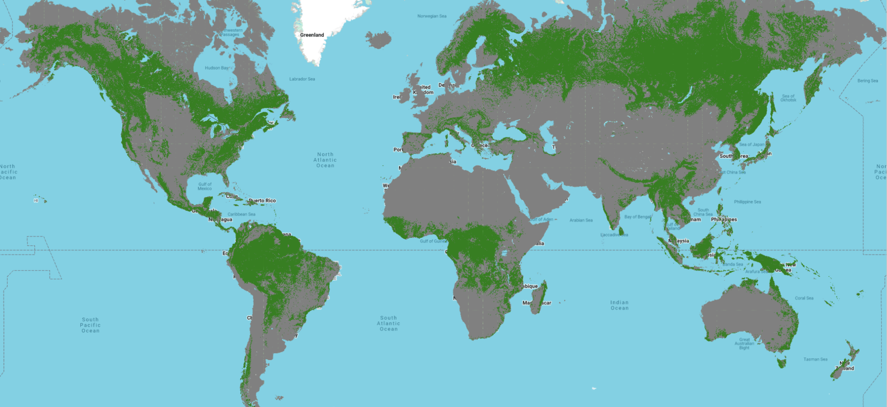

# Forest Topology

Protecting biodiversity and curbing carbon emissions from deforestation demands
a deeper understanding of global forest cover. Informed decision-making hinges
not only on knowing where forests are, but on understanding their composition
and distinguishing natural forests that play critical roles as biodiversity
hotspots and major carbon sinks.

In a collaboration between [Google DeepMind](https://deepmind.google/) (GDM),
[World Resources Institute](https://www.wri.org/) (WRI) and
[Google Geo Sustainability](https://earthoutreachonair.withgoogle.com/), we
developed a novel approach to map natural forests, including primary and
secondary naturally regenerating forests, using semantic segmentation deep
learning model based on a multi-modal, multi-temporal vision transformer. The
resulting global natural forest map for 2020, produced in support of the
European Union's deforestation regulations (EUDR), provides a comprehensive
baseline for monitoring deforestation and guiding conservation efforts. To
support decision making in these efforts, next to the estimated probabilities of
natural forests we also release a layer of model uncertainty.

<div style="text-align:center">
    <figure>
        
        <figcaption>
        Natural forests of the world (primary and secondary naturally regenerating).
        </figcaption>
    </figure>
</div>

TODO: Update with final image based on probabilities.


## Definitions

**Forest**: We follow the FAO/AFI definition of forest to have patches areas of
at least 0.5 hectares with trees heights being able to reach 5 meters and canopy
cover of at least 10%.

**Natural forest**: A forest that is a natural ecosystem (in terms of species
composition, structure, and ecological function). It includes primary forests,
with no major human impact in recent history as well as naturally regenerating
secondary forests - where the forest ecosystem has attained much of the prior or
other contemporary natural ecosystems. It can include managed natural forests,
where much of the ecosystem's composition, structure, and ecological function
exists in presence of harvesting of timber or other forest products, including
promoting high-value species, and low-intensity, small-scale cultivation within
the forest. Also, partly degraded forests are included (not converted and
degradation does not result in the sustained reduction of tree cover below the
thresholds).

## Natural Forests of the World (v1)
Below are the details for the first release of the natural forest map.
### Data characteristics

*   Resolution: 10 meters
*   Spatial extent: global
*   Temporal extent: version `2020_v1_0` estimates natural forest probability for
    the year 2020.
*   The data is available on GCP in GeoTIFF files, with 1 UTM zone cell per file
    or as a single global GeoTIFF.
*   File naming: `"raster_{UTM_CELL}.tif"`, where `UTM_CELL` represents the
    [Universal Transverse Mercator (UTM)](https://en.wikipedia.org/wiki/Universal_Transverse_Mercator_coordinate_system)
    cell ID of the form `{longitude number id}{latitude letter id}` (for example
    `"18T"` is the UTM ID for the cell containing New York City).
*   Bands (`uint8` data type):
    *   Band 1: Probability of "Natural forest" class (scaled to [0-250]).
    *   Band 2: Model uncertainty estimate (scaled to [0-250]).

### Data locations and download instructions

TODO: Update once placing final data into the bucket.

GCP data location:
[https://storage.googleapis.com/forest_typology](https://storage.googleapis.com/forest_typology)

You can download the data using
[Cloud SDK](https://cloud.google.com/sdk/docs/quickstart), which provides the
`gsutil` utility, with a command like

```bash
gsutil -m cp -r gs://forest_typology/natural_forest_2020_v1_0 /tmp/
```

or using `wget` via:

```bash
wget https://storage.googleapis.com/forest_typology/natural_forest_2020_v1_0/global.tif
```

<!-- GEE asset ID: TBD -->

## Citing this work

TODO: Update once the publication is finalized and submitted.

You can cite this work as

```latex
@article{natural_forest,
    title={Natural forests of the world},
    author={TBD},
    year={2025},
    note={Draft},
}
```

## License and disclaimer

Copyright 2025 DeepMind Technologies Limited

All software is licensed under the Apache License, Version 2.0 (Apache 2.0); you
may not use this file except in compliance with the Apache 2.0 license. You may
obtain a copy of the Apache 2.0 license at:
https://www.apache.org/licenses/LICENSE-2.0

All other materials are licensed under the Creative Commons Attribution 4.0
International License (CC-BY). You may obtain a copy of the CC-BY license at:
https://creativecommons.org/licenses/by/4.0/legalcode

Unless required by applicable law or agreed to in writing, all software and
materials distributed here under the Apache 2.0 or CC-BY licenses are
distributed on an "AS IS" BASIS, WITHOUT WARRANTIES OR CONDITIONS OF ANY KIND,
either express or implied. See the licenses for the specific language governing
permissions and limitations under those licenses.

This is not an official Google product.
