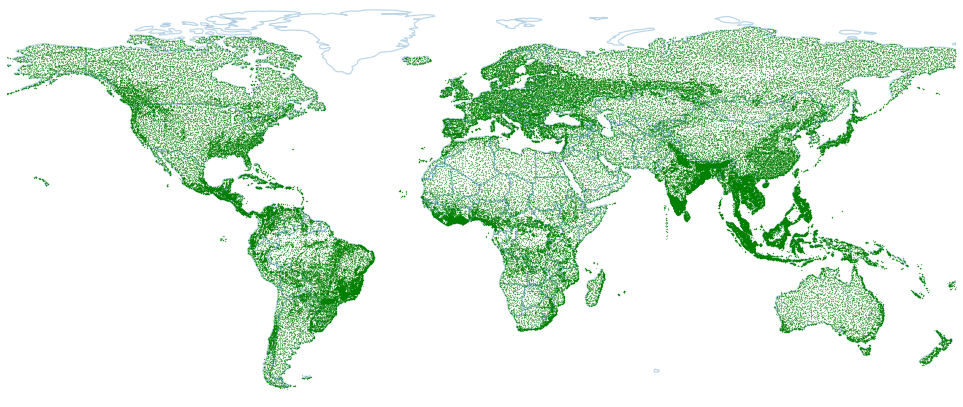
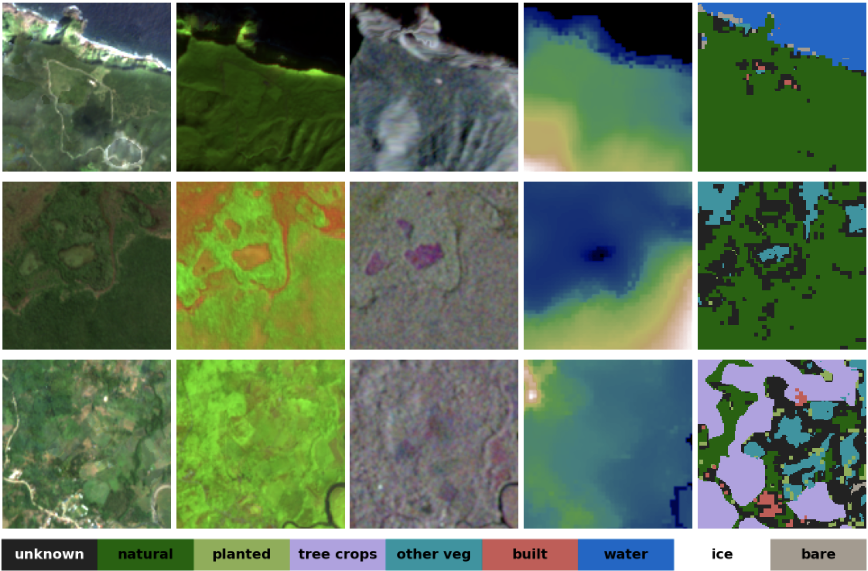

# ForTy (v1): A Benchmark Dataset for Global Forest Types Mapping

Paper: [Not every tree is a forest: benchmarking forest types from satellite
remote sensing](https://arxiv.org/abs/2505.01805)

ForTy is a new large-scale, multi-modal, and multi-temporal benchmark dataset
designed for advancing global FORest TYpes mapping. It comprises 200,000 time
series of image patches, each including Sentinel-2, Sentinel-1, climate, and
elevation data. The dataset features per-pixel annotations that distinguish
between three key forest types (natural forest, planted forest, tree crops) and
five other land use/land cover classes. This benchmark aims to support the
development of accurate and reliable models critical for efforts like halting
deforestation, biodiversity conservation, and compliance with regulations such
as the European Union Deforestation Regulation (EUDR).

<p align="center">
<div style="text-align:center">
    <figure>
        
        <br>
        <figcaption>
        <strong>ForTy (v1) sample locations.</strong>
        </figcaption>
    </figure>
</div>
</p>

Accurate differentiation between various forest types (e.g., natural forests,
planted forests, and tree crops) is crucial for effective policy-making,
conservation strategies, and sustainable forest management. Most existing land
use products and benchmarks often categorize all forest areas into a single
class or lack the detailed per-pixel annotations needed for precise segmentation
tasks on a global scale. ForTy addresses these limitations by providing:

-   **Detailed Forest Classes:** Distinguishing between natural forests, planted
    forests, and tree crops.
-   **Per-Pixel Labels:** Enabling image segmentation tasks at 10 meter
    resolution.
-   **Multi-modal & Multi-temporal Data:** Incorporating multi-spectral/optical,
    polarimetric synthetic aperture radar (SAR), climate, and elevation data
    over time to capture complex variations.
-   **Global Coverage:** Covering most land areas with a bias for diverse forest
    types, leveraging multiple public data sources.

## Dataset characteristics

*   **Total Samples:** 200,000 globally distributed time series of image patches
    (about 1 TB).
*   **Patch Size:** Each plot covers a 1280 x 1280 meter area.
*   **Input Modalities:**
    *   **Sentinel-2:** Multispectral optical imagery (10 bands, 10m and 20m
        resolution). Seasonal mosaics for 2020.
    *   **Sentinel-1:** Synthetic Aperture Radar (SAR) data (VV and VH
        polarizations, ascending/descending orbits, 10m resolution). Same
        temporal extent as Sentinel-2.
    *   **Climate Data:** Monthly climate and water balance variables (~4km
        resolution, from TerraClimate).
    *   **Elevation Data:** Elevation, slope, and aspect (30m resolution, from
        FABDEM).
*   **Temporal Information:** Each time series captures variations at monthly or
    seasonal cadence.
*   **Annotations:** Per-pixel segmentation labels.
*   **Land Cover Classes (8 classes):**
    1.  Natural Forest
    2.  Planted Forest
    3.  Tree Crops
    4.  Other Vegetation (shrubland, grassland, cropland)
    5.  Water
    6.  Ice
    7.  Bare Ground
    8.  Built Areas
    9.  *Unknown* label is used for pixels with disagreement between source
        datasets during integration or if unknown.
*   **Data Splitting:** The dataset is divided into training, validation, and
    test sets using geographically distinct 100 km x 100 km blocks to reduce
    spatial autocorrelation and ensure robust model evaluation. Split sizes:
    *   train: 160,191
    *   validation: 19,661
    *   test: 20,148
*   **Features in each example**: Dimensions are `([Time steps/cadence], Height,
    Width, [Number of bands/channels])`. The temporal and spectral dimensions
    are optional, depending on the data type.

    | Name                  | Dimensions      | Dtype     | Description      |
    | --------------------- | --------------- | --------- | ---------------- |
    | `id`                  | `()`            | `int64`   | Sample ID        |
    | `lat`                 | `()`            | `float64` | Latitude [deg]   |
    | `lon`                 | `()`            | `float64` | Longitude [deg]  |
    | `s2`                  | `(4, 128, 128, 10)`  | `float32` | Seasonal Sentinel-2 |
    | `s2_mask`             | `(4, 128, 128, 10)` | `uint8`   | Seasonal Sentinel-2 mask |
    | `s1_asc`              | `(4, 128, 128, 3)` | `float32` | Seasonal Sentinel-1 ascending |
    | `s1_asc_mask`         | `(4, 128, 128, 3)`  | `uint8`   | Seasonal Sentinel-1 ascending mask |
    | `s1_desc`             | `(4, 128, 128, 3)` | `float32` | Seasonal Sentinel-1 descending |
    | `s1_desc_mask`        | `(4, 128, 128, 3)` | `uint8`   | Seasonal Sentinel-1 descending mask |
    | `elevation`           | `(128, 128, 3)` | `float32` | Elevation [m], slope, aspect |
    | `climate`             | `(4, 1, 1, 14)` | `float32` | Seasonal climate variables |
    | `segmentation_labels` | `(128, 128)`    | `uint8`   | Segmentation labels |

*   **Visualization of some examples**

<p align="center">
<div style="text-align:center">
    <figure>
        
        <br>
        <figcaption><strong>
        Each row represents one sample location. Columns from left to right: (1) Sentinel-2 RGB bands, (2) Sentinel-2 SWIR-NIR-Red bands, (3) multi-temporal Sentinel-1 VV winter-spring-summer composition, (4) elevation, (5) labels. Bottom row: color bar for labels.
        </strong></figcaption>
    </figure>
</div>
</p>

## Data Access

The ForTy v1 dataset is publicly available on Google Cloud Storage (GCS).
Current last version is `1.0.0`.

*   **GCS Bucket:** `gs://forest_typology/forty_v1/1.0.0`
*   **Browseable Link:**
    [https://console.cloud.google.com/storage/browser/forest_typology/forty_v1/1.0.0](https://console.cloud.google.com/storage/browser/forest_typology/forty_v1/1.0.0)

The dataset is provided in the `TFRecord` format. It is split into `train`,
`test`, and `validation` sets. Each split is further divided into 1024 shards to
facilitate efficient loading and processing. The file naming convention for the
shards is `forty_v1-{split}.tfrecord-{shard_num:05d}-of-{num_shards:05d}` (e.g.,
`forty_v1-train.tfrecord-00000-of-01024`).

The data can be downloaded using
[Cloud SDK](https://cloud.google.com/sdk/docs/quickstart), which provides the
`gcloud` utility, with a
[command](https://cloud.google.com/storage/docs/discover-object-storage-gcloud#download_the_object_from_your_bucket)
like (be careful that it will start a download of 1 TB):

```bash
mkdir /tmp/forty_v1
gsutil storage cp -r gs://forest_typology/forty_v1/1.0.0 /tmp/forty_v1/
```

## Data Usage

The simplest way to use the data is via Tensorflow Datasets
([TFDS](https://www.tensorflow.org/datasets)).
These python commands demonstrate one way how to access it:

```python
import tensorflow_datasets as tfds
ds = tfds.load("forty_v1", data_dir="gs://forest_typology", try_gcs=True)
# Get a batch of 4 examples (as numpy arrays) for inspection
batch = next(ds["train"].batch(4).as_numpy_iterator())
```

For more, check the [notebook example](forty_v1_demo.ipynb).

## Citing this work

You can cite this work as

```
@inproceedings{jiang2025:forty-igarss,
  title={Not every tree is a forest: benchmarking forest types from satellite
  remote sensing},
  author={Yuchang Jiang and Maxim Neumann},
  booktitle={Presented at IEEE IGARSS 2025},
  url={https://arxiv.org/abs/2505.01805},
  pages={1-6},
  year={2025}
}
```

## License and disclaimer

Copyright 2025 DeepMind Technologies Limited

The ForTy (v1) dataset has a
[Creative Commons Attribution ShareAlike 4.0 International License](https://creativecommons.org/licenses/by-sa/4.0/deed.en).

All other non-software materials are licensed under the Creative Commons
Attribution 4.0 International License (CC-BY). You may obtain a copy of the
CC-BY license at: https://creativecommons.org/licenses/by/4.0/legalcode

Unless required by applicable law or agreed to in writing, all software and
materials distributed here under the Apache 2.0 or CC-BY licenses are
distributed on an "AS IS" BASIS, WITHOUT WARRANTIES OR CONDITIONS OF ANY KIND,
either express or implied. See the licenses for the specific language governing
permissions and limitations under those licenses.

This is not an official Google product.
