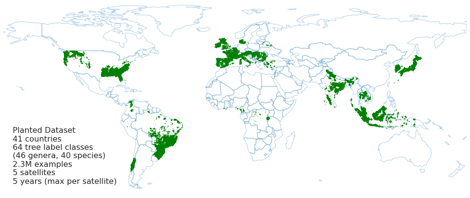

# Planted: A Dataset for Planted Forest Identification from Multi-Satellite Time Series

Paper: [Planted: a dataset for planted forest identification from
multi-satellite time series](https://arxiv.org/abs/2406.18554)

This repository provides information and access to the **Planted** benchmark
dataset, a global, multimodal, multi-temporal, and multi-scale classification
dataset designed to foster research in forest monitoring using diverse satellite
data sources.

The dataset consists of data from five public satellites for recognizing forest
plantations and planted tree species across the globe. Each satellite modality
consists of a multi-year time series. In the initial version (1.0.0) the dataset
includes over 2 million examples of 64 tree label classes (46 genera and 40
species), distributed among 41 countries. For more details, see the
[paper](https://arxiv.org/abs/2406.18554).

<p align="center">
<div style="text-align:center">
    <figure>
        
        <br>
        <figcaption><strong>
        Overview of the Planted dataset and the geographical samples distribution.
        </strong></figcaption>
    </figure>
</div>
</p>

## Key Features

*   **Global Coverage:** Samples from 41 countries.
*   **Rich Class Diversity:** 64 tree label classes, including 46 genera and 40
    species.
*   **Large Scale:** Over 2.3 million examples.
*   **Multimodal:** Data from 5 different satellites.
*   **Multi-temporal:** Time series data, up to 5 years (max per satellite).
*   **Multi-scale:** Varying resolutions due to different satellite sources.

## Dataset Details

The latest version (1.2.0) provides 3 subsets:

*   **all**: 2,264,747 examples (261 GB), with 64 *common name* labels,
    including 46 *genera* and 40 *species* labels where available.
*   **species**: 1,348,219 examples (155 GB), with 40 *species* labels.
*   **fmeval**: 77,570 examples (9 GB), that has been designed to evaluate
    geospatial foundation models, containing 21 genus labels with a minimum of
    100 examples, and the maximum clipped at 10,000 examples per class.

Each example in the Planted dataset contains satellite imagery, labels, and
metadata. Image patches cover an area of 120 meters x 120 meters.

### Satellite Data

The dataset includes imagery from the following five public satellite sources:

1.  **Sentinel-1 (S1):** Synthetic Aperture Radar (SAR), C-Band, VV and VH
    polarizatons.
2.  **Sentinel-2 (S2):** Multispectral imagery
3.  **Landsat 7 (L7):** Multispectral imagery
4.  **ALOS-2 PALSAR-2:** Synthetic Aperture Radar (SAR), L-Band, HH and HV
    polarizations
5.  **MODIS:** Medium Resolution Imaging Spectroradiometer (Multispectral)

For each satellite image source and time sample, timestamps (milliseconds since
*1970-01-01T00:00:00Z* and date strings `YYYY-MM-DD`) and a binary mask of pixel
validity are provided.

### Labels

Each example is labeled with:

*   **Common name class** (64 classes)
*   **Genus** (46 genera)
*   **Tree species** (40 species, when known)
*   Additional categorization is available:
    *   Broad-leaf vs. Conifer
    *   Evergreen vs. Deciduous
    *   Hard- vs. Soft-wood
    *   Planted trees vs. Tree crops

Labels are based on a curated subset of the "Spatial Database of Planted Trees"
(Harris et al., 2019). The dataset is unbalanced, and frequency annotations
(rare, common, frequent) are provided for species labels.

### Metadata

Additional metadata for each forest plantation includes:

*   Country
*   Area of the plantation (hectares)
*   Perimeter of the plantation
*   Elevation (meters), slope, and aspect
*   Center latitude and longitude (degrees)

## Data Access

The Planted dataset (version 1.2.0) is available for download at:
[https://console.cloud.google.com/storage/browser/forest_typology/planted-public](https://console.cloud.google.com/storage/browser/forest_typology/planted-public)

## Citing this work

You can cite this work as:

Pazos-Outón, L. M., Nader Vasconcelos, C., Raichuk, A., Arnab, A., Morris, D., &
Neumann, M. (2024). *[Planted: a dataset for planted forest identification from
multi-satellite time series](https://arxiv.org/abs/2406.18554)*. arXiv preprint
arXiv:2406.18554.

BibTeX:

```
@article{pazos-outon2024:planted,
  title={Planted: a dataset for planted forest identification from
  multi-satellite time series},
  author={Luis Miguel Pazos-Out{\'o}n and Cristina Nader Vasconcelos and Anton
  Raichuk and Anurag Arnab and Dan Morris and Maxim Neumann},
  journal={arXiv preprint arXiv:2406.18554},
  url={https://arxiv.org/abs/2406.18554},
  year={2024}
}
```

## License and disclaimer

Copyright 2025 DeepMind Technologies Limited

All non-software materials are licensed under the Creative Commons Attribution
4.0 International License (CC-BY). You may obtain a copy of the CC-BY license
at: https://creativecommons.org/licenses/by/4.0/legalcode

Unless required by applicable law or agreed to in writing, all software and
materials distributed here under the Apache 2.0 or CC-BY licenses are
distributed on an "AS IS" BASIS, WITHOUT WARRANTIES OR CONDITIONS OF ANY KIND,
either express or implied. See the licenses for the specific language governing
permissions and limitations under those licenses.

This is not an official Google product.
